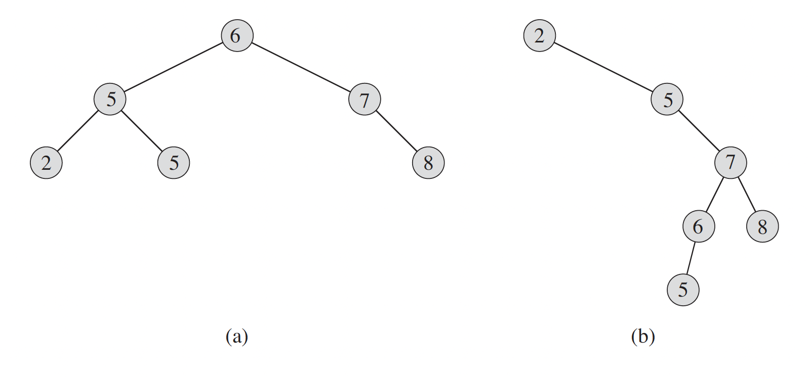
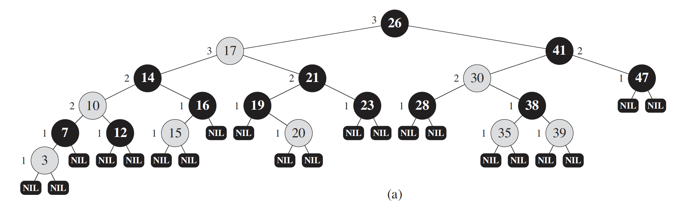

## Binary search tree

A binary search tree is organized, as the name suggests, in a binary tree. We can represent such a tree by a linked data structure in which each node is an object. In addition to a key and satellite data, each node contains attributes left, right, and p that point to the nodes corresponding to its left child, its right child, and its parent, respectively. If a child or the parent is missing, the appropriate attribute contains the value None. The root node is the only node in the tree whose parent is None.

The keys in a binary search tree are always stored in such a way as to satisfy the binary-search-tree property:
Let $x$ be a node in a binary search tree. If $y$ i s a node in the left subtree of $x$,
then $y.key \leq x.key$. If $y$ is a node in the right subtree of $x$, then $y.key \geq x.key$.

Ниже примеры двух бинарных дерева поиска (обратите внимание на значения ключей). Левое дерево является сбалансированным, в общем случае поиск по нему будет выполняться за $O(\log n)$. Правое дерево несбалансировано, поэтому мы чаще будем попадать в worst case $O(n)$.
 

## Reb-black tree

A red-black tree is a binary tree that satisfies the following red-black properties:
1. Every node is either red or black.
2. The root is black.
3. Every leaf (None) is black.
4. If a node is red, then both its children are black.
5. For each node, all simple paths from the node to descendant leaves contain the same number of black nodes.

For the worst case, it has the following complexities:
* Search: $O(\log n)$ (compare to a plain binary search tree: $O(n)$)
* Insert: $O(\log n)$ (compare to a plain binary search tree: $O(n)$)
* Delete: $O(\log n)$ (compare to a plain binary search tree: $O(n)$)

